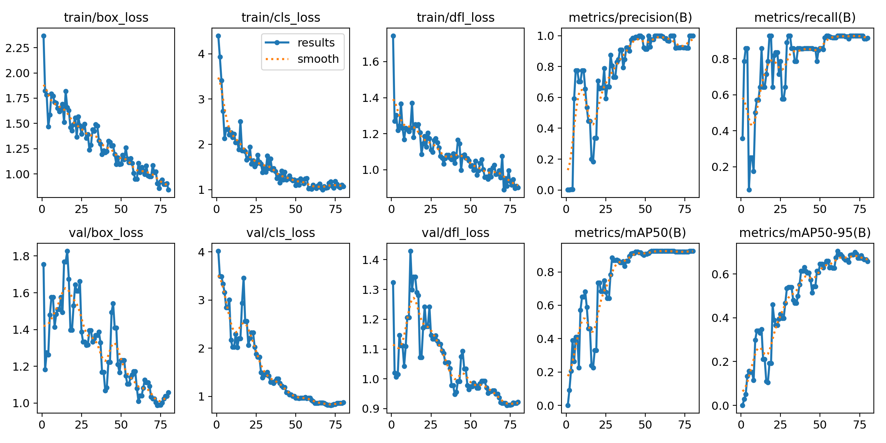
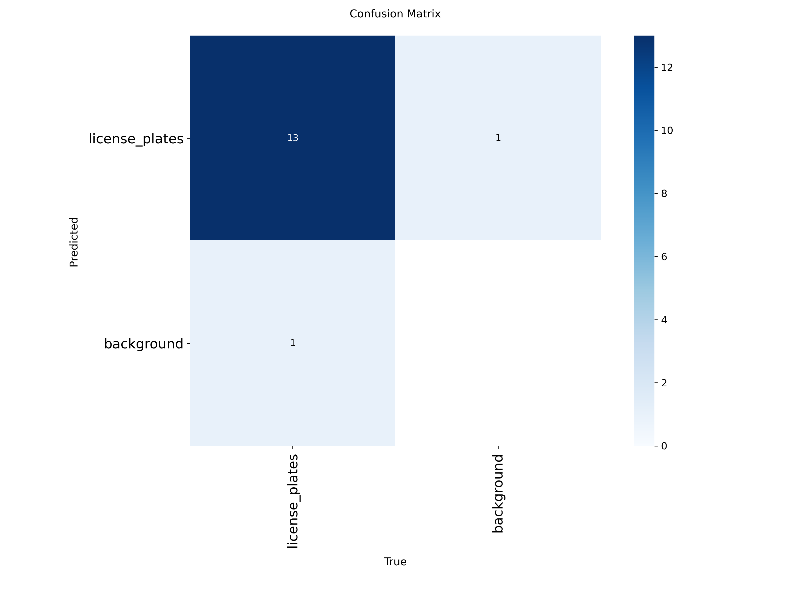
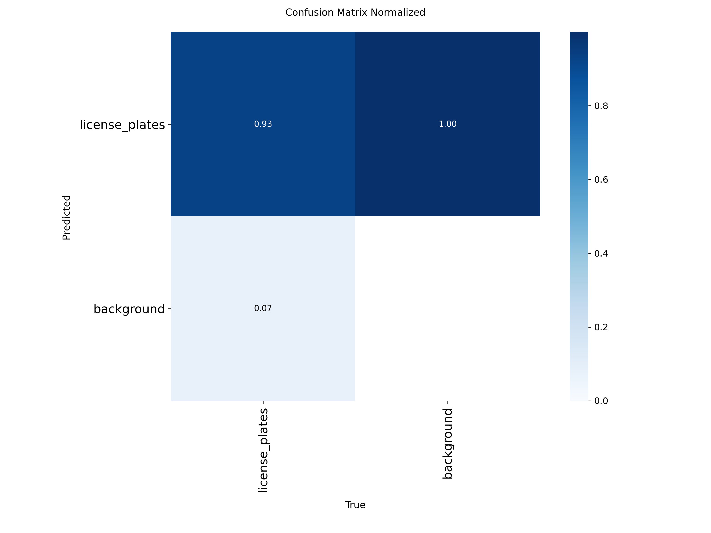
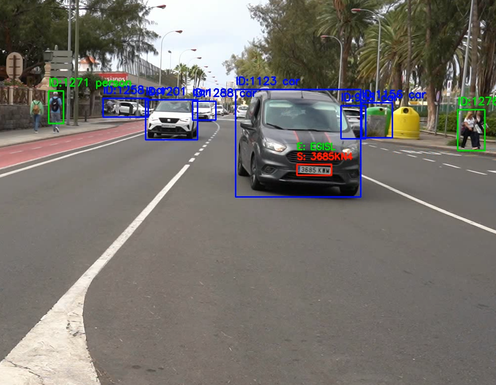
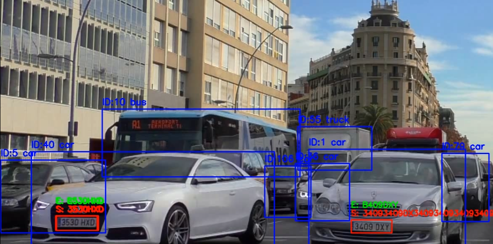
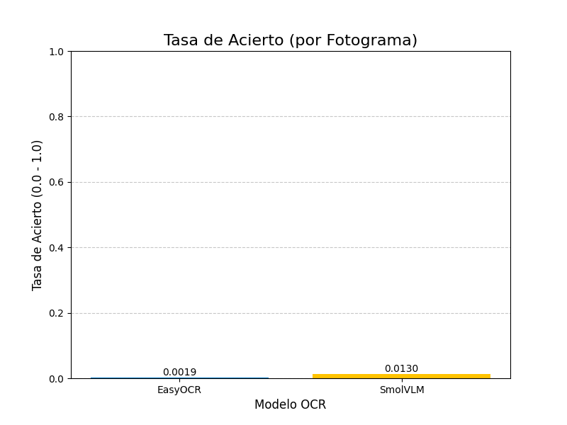
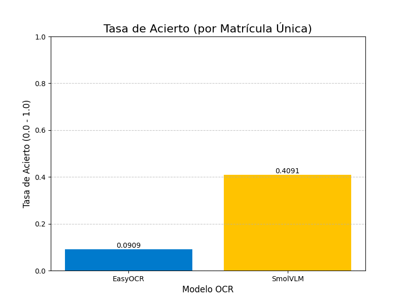

# Práctica 4/4b - Detección de Matrículas (YOLO) y Comparativa OCR (EasyOCR vs SmolVLM)

El objetivo de esta práctica es doble. Primero, entrenar un modelo YOLO (P4) capaz de detectar matrículas de vehículos en vídeo. Segundo, utilizar este detector para crear un pipeline que extraiga las matrículas y compare el rendimiento (precisión y velocidad) de dos modelos OCR: **EasyOCR** y el modelo de lenguaje y visión (VLM) **SmolVLM** (P4b).

## Autor

## Librerías Clave

* `ultralytics` (YOLO)
* `easyocr`
* `transformers` (para SmolVLM)
* `torch`
* `BitsAndBytesConfig` (para cuantización 4-bit)
* `cv2` (OpenCV)
* `numpy`
* `PIL` (Pillow)
* `csv`
* `time`

---

## TAREA 1 (P4): Entrenamiento del Detector de Matrículas (YOLO)

El primer paso fue entrenar un modelo YOLO (partiendo de `yolo11n.pt`) para detectar la clase "matrícula". Se utilizó el dataset compartido por los compañeros y etiquetado manualmente con `labelme`.

* **Paso 1:** Preparar el dataset con anotaciones en formato YOLO.
* **Paso 2:** Definir el archivo `train.yaml` apuntando a las imágenes y clases.
* **Paso 3:** Ejecutar el entrenamiento (`mode: train`) durante 80 épocas con un `batch` de 4.
* **Paso 4:** Seleccionar el mejor modelo (`best.pt`) basado en las métricas de validación.

### Resultados del Entrenamiento (P4)

El entrenamiento generó las siguientes métricas y matrices de confusión:

---

## TAREA 2 (P4b): Pipeline de Detección y Comparativa OCR

Con el modelo `best.pt` entrenado, se construyó un pipeline para procesar vídeo, detectar vehículos, localizar matrículas y comparar los dos modelos OCR.

* **Paso 1: Carga de Modelos**
    * `model_general`: YOLO (`yolo11n.pt`) para detectar objetos (personas, coches, buses).
    * `model_placas`: YOLO (`best.pt`) entrenado en la Tarea 1 para detectar matrículas.
    * `reader`: `easyocr.Reader()` configurado para español en GPU.
    * `model_vlm`: `SmolVLM-256M-Instruct` cargado con cuantización 4-bit para reducir el uso de memoria.

* **Paso 2: Procesamiento de Vídeo**
    * Se lee un vídeo de entrada (`C0142.mp4`) fotograma a fotograma.
    * Se aplica `model_general.track()` para detectar y asignar un ID de seguimiento a coches, buses y camiones.

* **Paso 3: Detección de Matrícula**
    * Para cada vehículo detectado, se recorta su bounding box (`vehicle_crop`).
    * Se aplica `model_placas.predict()` sobre `vehicle_crop` para encontrar la matrícula.

* **Paso 4: Filtro de Confianza y OCR**
    * **Importante:** Solo si la confianza de la matrícula detectada es `> 0.5`, se procede al OCR.
    * Se recorta la matrícula (`plate_crop`).
    * Se ejecuta **EasyOCR** sobre `plate_crop`, se mide el tiempo (`time_easyocr`) y se limpia el texto.
    * Se ejecuta **SmolVLM** sobre `plate_crop` (usando el prompt `USER: <image>\nWhat is the text on the license plate?\nASSISTANT:`), se mide el tiempo (`time_smolvlm`) y se limpia el texto.

* **Paso 5: Visualización y Almacenamiento**
    * Se dibujan los resultados de ambos OCR sobre el fotograma de vídeo.
    * Se escribe toda la información (IDs, coordenadas, textos OCR, tiempos) en un `resultados.csv` para su análisis posterior.

### Links de los Vídeos Resultado

También se realizó una detección en un segundo vídeo, este último solo se realizo a manera de prueba para observar los resultados en el vídeo, no se analizaron los resultados profundamente.

---

## TAREA 3: Análisis de Resultados y Conclusiones

Se analizaron los datos del archivo `resultados.csv` (que contiene 4623 fotogramas válidos donde se detectó una matrícula con confianza > 0.5) para comparar ambos modelos OCR.

### Informe de Comparativa de OCR

* **MÉTRICA A: Tasa de Acierto (por Fotograma)**
    * Aciertos EasyOCR: 9 / 4623 (Tasa de acierto: **0.19%**)
    * Aciertos SmolVLM: 60 / 4623 (Tasa de acierto: **1.30%**)

    

* **MÉTRICA B: Tasa de Acierto (por Matrícula Única)**
    * Total de matrículas únicas anotadas: 22
    * Aciertos EasyOCR: 2 / 22 (Tasa de acierto: **9.09%**)
    * Aciertos SmolVLM: 9 / 22 (Tasa de acierto: **40.91%**)

    

* **MÉTRICA C: Tiempos de Inferencia (Velocidad)**
    * Tiempo promedio EasyOCR: **0.0164 seg/matrícula**
    * Tiempo promedio SmolVLM: **2.4248 seg/matrícula**
    * -> SmolVLM es **147.9 veces más lento** que EasyOCR.

    

### Conclusiones Clave

1.  **Precisión (Acierto):** **SmolVLM es significativamente más preciso** que EasyOCR en este escenario. En la métrica más relevante (acierto por matrícula *única*), SmolVLM (40.91%) supera con creces a EasyOCR (9.09%). Esto sugiere que los Modelos de Lenguaje y Visión (VLMs) tienen una capacidad superior para interpretar imágenes de baja resolución o en ángulos complejos, como las matrículas.

2.  **Velocidad:** **EasyOCR es drásticamente más rápido** (casi 148 veces más veloz). Su tiempo de inferencia es despreciable, lo que lo hace ideal para aplicaciones en tiempo real estricto.

3.  **Trade-off:** La elección del modelo depende del caso de uso.
    * Para una aplicación que necesite **alta velocidad** y donde la precisión no sea crítica (quizás un conteo simple), **EasyOCR** es la elección clara.
    * Para una aplicación donde la **precisión es fundamental** y se puede procesar el vídeo *offline* (o con hardware muy potente), **SmolVLM** ofrece resultados muy superiores. La latencia actual de 2.4 segundos por matrícula lo hace inviable para la mayoría de sistemas en tiempo real, incluso usando cuantización 4-bit.